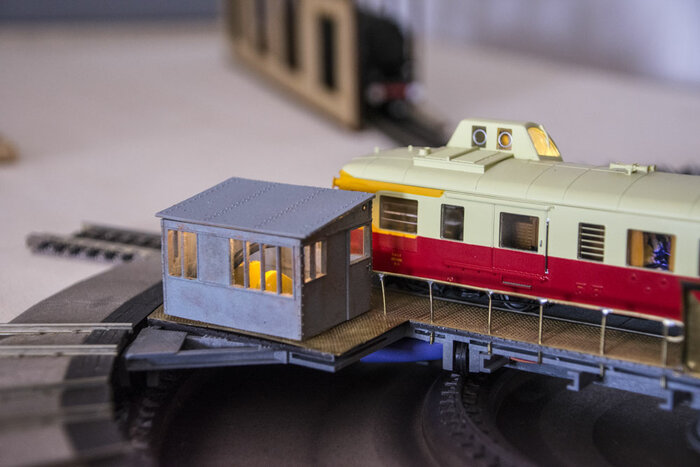

# Automatisation d'un pont tournant FLEISCHMANN 6152 (HO) en WiFi avec un ESP32

Le pont se pilote à partir d'un navigateur. L'application web est une simple page HTML qui communique en websockets et qui est copiée dans la SPIFFS de l'ESP32.

J'ai placé sous le pont un module de prototypage ESP32 et une carte moteur Pololu A4990.

Le programme sur l'ESP32 est écrit en C/C++ au travers de l'IDE Arduino.

Le programme cherche à chaque fois le chemin le plus court pour se rendre d'une porte à une autre. Il gère le retournement, c'est à dire qu'une locomotive entrée en avant sur une voie peut sortir en arrière sur une autre. Dans ce cas, la polarité des rails est automatiquement inversée.

Regarder sur Youtube : https://youtu.be/Rx7vND9eew4

# Mon Projet

Voici une démonstration vidéo de l'application :

)

Cliquez sur l'image pour voir la vidéo ou [regardez-la directement sur YouTube](https://www.youtube.com/watch?v=dQw4w9WgXcQ).

